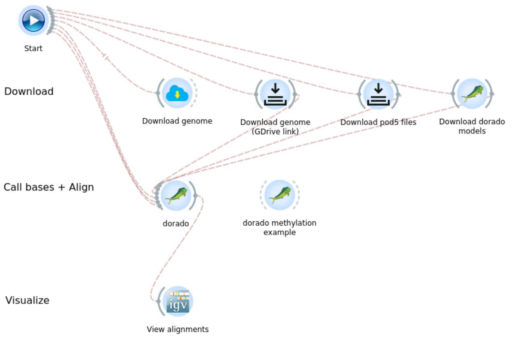
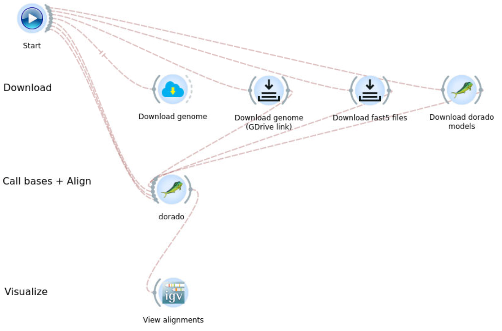
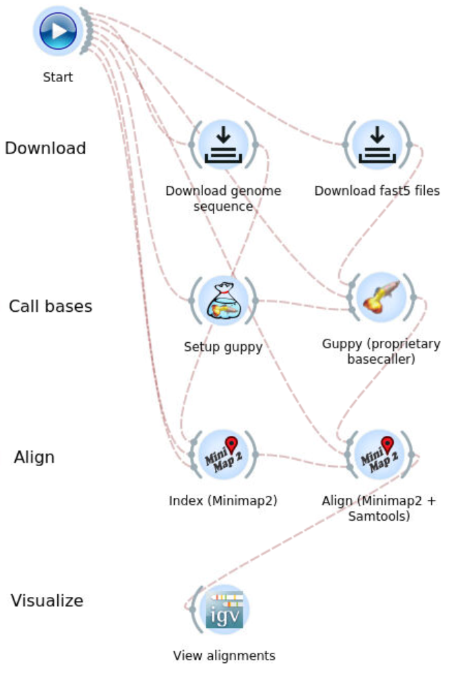
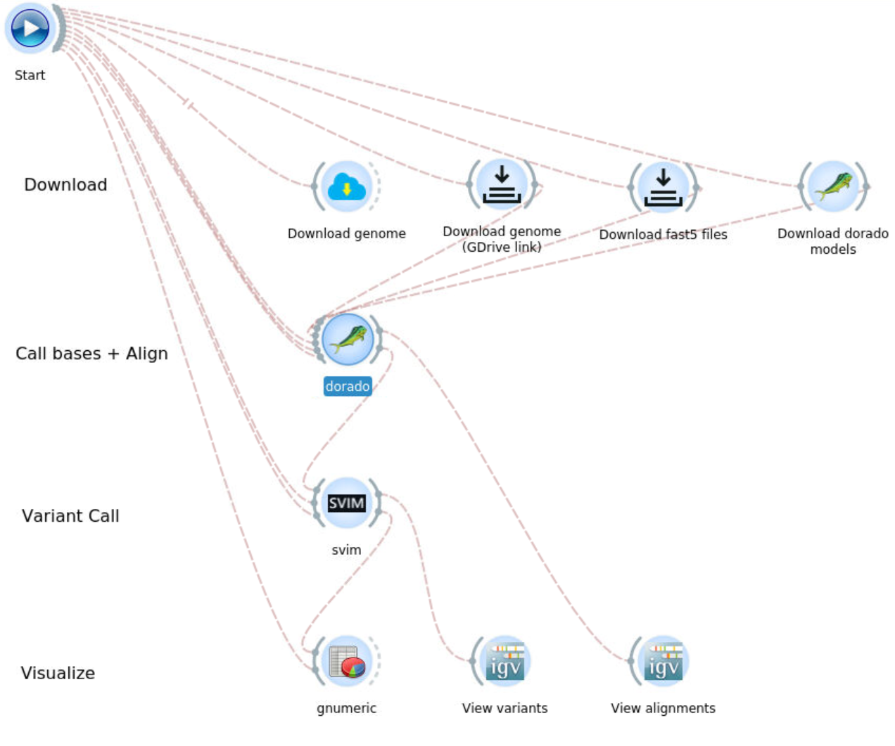
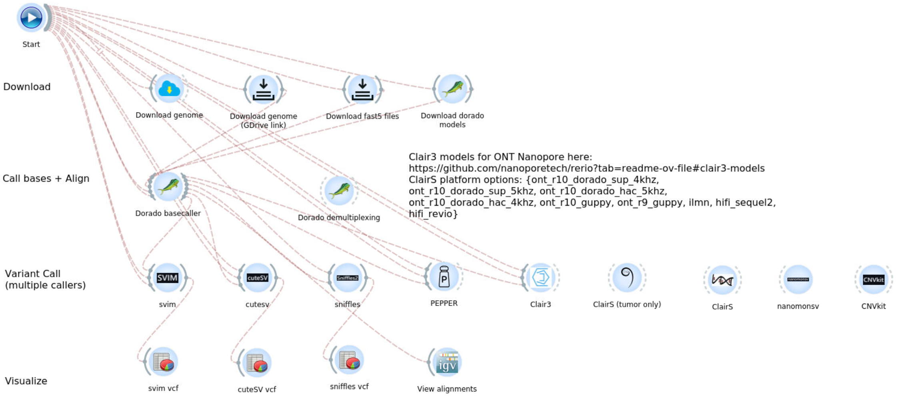
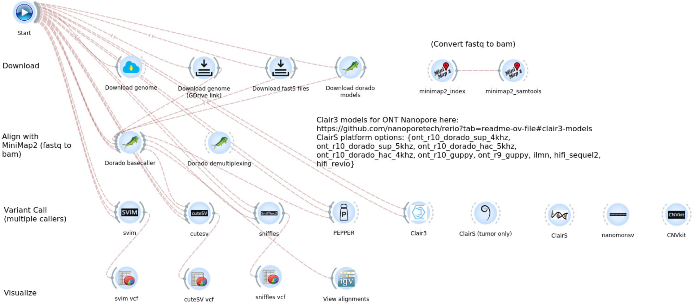

# nanopore-workflows
A collection of ONT Nanopore workflows implemented using [BioDepot-workflow-builder (Bwb)](https://github.com/BioDepot/BioDepot-workflow-builder).

## Nanopore Dorado

This workflow processes raw nanopore sequencing data Pod5 files using the [Dorado](https://github.com/nanoporetech/dorado) basecaller. It converts raw signal data into basecalled and aligned sequences.

### Usage
- Pod5 files (.pod5) for one sample and reference genonme (FASTA .fa or MiniMap2 .mmi) as inputs. Sample Pod5 files reference genome are provided as downloads.
- Base called, aligned, and sorted BAM file as main output using Dorado.
- Alternative Dorado widget provided for modified/methylation calls.
- Visualize BAM file output using [Integrative Genomics Viewer (IGV)](https://github.com/igvteam/igv).

## Nanopore Dorado Fast5input

This workflow processes Fast5 files using the [Dorado](https://github.com/nanoporetech/dorado) basecaller.

**NOTE**: Dorado supports Fast5 file formats but recommends using Pod5. Dorado cannot automatically select the optimal model to use for basecalling, requiring the user to specify the model.

### Usage
- Fast5 files (.fast5) for one sample and reference genonme (FASTA .fa or MiniMap2 .mmi) as inputs. Sample Fast5 files reference genome are provided as downloads.
- Base called, aligned, and sorted BAM file as main output using Dorado.
- Visualize BAM file output using IGV.

## Nanopore Guppy

This workflow processes raw nanopore sequencing data using the Guppy basecaller.

**NOTE:** Guppy has been superseded by Dorado.

### Usage
- Fast5 files (.fast5) for one sample and reference genonme (FASTA .fa or MiniMap2 .mmi) as inputs. Sample Fast5 files reference genome are provided as downloads.
- Base called, aligned, and sorted BAM file as main output using Guppy and MiniMap2.
- Visualize BAM file output using IGV.

## Nanopore Itd

This workflow identifies and processes insertion, deletion, and tandem duplication (ITD) variants in nanopore sequencing data. The main variant caller used in this workflow is [SVIM](https://github.com/eldariont/svim).

### Usage
- Fast5 or Pod5 files for one sample and reference genonme (FASTA .fa or MiniMap2 .mmi) as inputs. Sample Fast5 files reference genome are provided as downloads.
- Base called, aligned, and sorted BAM file as main output using Dorado.
- Detect structural variants using SVIM.
- Options to view the listed variants from SVIM's "variants.vcf" file, and visuzlizze aligned BAM file output using IGV.

## Nanopore Variantcall

This workflow performs variant calling on nanopore sequencing data using various variant callers:
- [SVIM](https://github.com/eldariont/svim)
- [CuteSV](https://github.com/tjiangHIT/cuteSV)
- [Sniffles2](https://github.com/fritzsedlazeck/Sniffles)
- [PEPPER](https://github.com/kishwarshafin/pepper)
- [Clair3](https://github.com/HKU-BAL/Clair3)
- [ClairS](https://github.com/HKU-BAL/ClairS)
- [ClairS-TO](https://github.com/HKU-BAL/ClairS-TO)
- [nanomonsv](https://github.com/friend1ws/nanomonsv)
- [CNVkit](https://github.com/etal/cnvkit)

### Usage
- Fast5 or Pod5 files for one sample and reference genonme (FASTA .fa or MiniMap2 .mmi) as inputs. Sample Fast5 files reference genome are provided as downloads.
- Base called, aligned, and sorted BAM file as main output using Dorado.
- Additional Dorado widget for demultiplexing (splitting basecalled and aligned Bam file into barcodes) provided.
- Run variant callers to detect variants.
- Options to view the listed variants from SVIM's "variants.vcf" file, and visuzlizze aligned BAM file output using IGV.

## Nanopore Variantcall Barcoded Fastq

This workflow is similar to [Nanopore Variantcall](#nanopore-variantcall), but it includes converstion of Fastq outputs from Dorado, or other sources, into aligned and sorted Bam file via MiniMap2.

